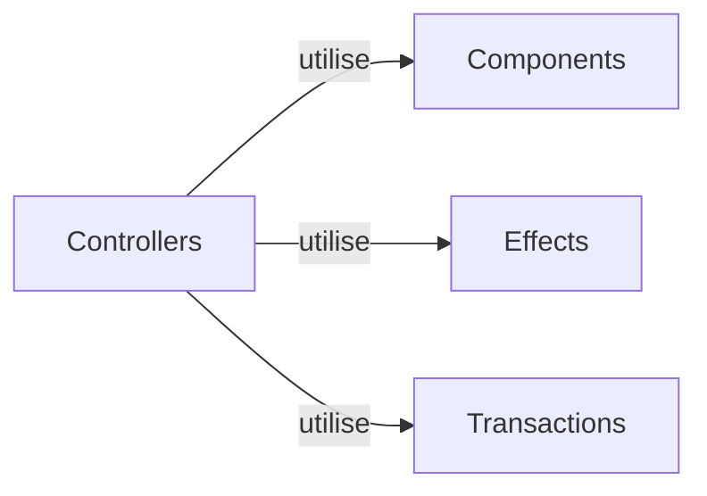
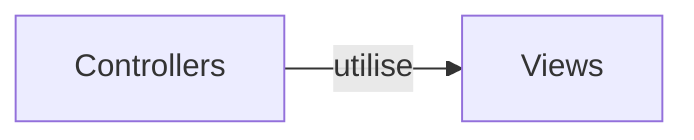

# Thorium Controllers

Les Controllers sont des composants de base du framework Thorium. Ils fournissent des fonctionnalités avancées pour la gestion et la manipulation des éléments DOM, ainsi que la coordination des interactions entre les différentes parties d'une application.

## **Qu'est-ce qu'un Controller ?**

Un Controller dans le framework Thorium est une classe qui encapsule la logique et les comportements associés à un élément ou à un groupe d'éléments dans l'interface utilisateur. Il offre des fonctionnalités avancées pour la gestion des événements, les mises à jour dynamiques du DOM, les effets visuels, la gestion des données, etc.

Les Controllers dans Thorium suivent le modèle de conception du **Design Pattern**. Ils permettent de découpler la logique métier de l'interface utilisateur, favorisant ainsi la modularité, la réutilisabilité et la facilité de maintenance du code.

## **Types de Controllers**

Le framework Thorium propose plusieurs types de Controllers, chacun adapté à un cas d'utilisation spécifique. Voici une présentation des principaux types de Controllers disponibles :

### **1. Controller de base**

Le **Controller de base** est le composant fondamental du framework Thorium. Il fournit des fonctionnalités essentielles pour la gestion des événements, la liaison de données, les transactions DOM, etc. Il sert de point de départ pour créer des Controllers plus spécifiques dans le cadre du framework Thorium.

Le Controller de base offre les fonctionnalités suivantes :

- Gestion des événements : il permet de définir des gestionnaires d'événements pour les interactions utilisateur, tels que les clics, les survols, les soumissions de formulaires, etc.
- Liaison de données : il permet de lier des données à des éléments DOM, facilitant ainsi la mise à jour dynamique du contenu en fonction des changements de données.
- Transactions DOM : il offre une interface pour effectuer des opérations de manipulation du DOM, telles que l'ajout, la suppression et la modification d'éléments.
- Gestion des données : il permet de récupérer et de mettre à jour des données à partir de sources externes, telles que des API, des bases de données, etc.
- Effets : il permet de définir des effets personnalisés, qui sont des callbacks exécutés à des moments spécifiques du cycle de vie du Controller. Les effets peuvent être utilisés pour effectuer des actions supplémentaires, telles que des animations, des appels réseau, des modifications d'état, etc.

### **2. ThoriumController**

Le **ThoriumController** est un composant de base du framework Thorium. Il étend le Controller de base en ajoutant des fonctionnalités spécifiques au framework. Il peut être utilisé comme base pour créer des Controllers personnalisés dans le cadre du framework Thorium.

Le ThoriumController offre les fonctionnalités suivantes :

- Héritage de comportement : il permet aux Controllers dérivés du ThoriumController de bénéficier des fonctionnalités communes du framework Thorium, telles que la gestion des transactions DOM, les effets, etc.
- Utilisation des conventions de nommage : il suit les conventions de nommage recommandées par le framework Thorium pour faciliter l'interopérabilité et la compréhension du code.
- Intégration avec d'autres composants Thorium : il s'intègre harmonieusement avec d'autres composants et fonctionnalités du framework Thorium, permettant ainsi de construire des applications cohérentes et modulaires.

### **3. ViewController**

Le **ViewController** est un type spécial de Controller dans le framework Thorium qui permet de créer des pivots, également appelés "views". Un pivot est un élément qui représente un contexte spécifique dans une interface utilisateur. Les ViewController facilitent la gestion de ces pivots en fournissant des fonctionnalités avancées pour la coordination et la gestion des transitions entre les différentes vues.

Les fonctionnalités offertes par le ViewController sont les suivantes :

- Gestion du contexte : il permet de définir et de gérer le contexte actuel du ViewController, qui correspond à la vue en cours d'affichage.
- Définition des vues : il permet de définir différentes vues associées au ViewController, avec la possibilité de spécifier une vue par défaut.
- Gestion des changements de contexte : il réagit aux changements de contexte en mettant à jour dynamiquement l'interface utilisateur pour afficher la vue correspondante.
- Intégration avec d'autres fonctionnalités Thorium : il s'intègre harmonieusement avec d'autres fonctionnalités du framework Thorium, telles que les transactions DOM, les effets, etc., pour offrir une expérience de développement fluide.

Les ViewController sont utiles pour créer des interfaces utilisateur complexes avec plusieurs vues ou états, où la transition entre les vues doit être gérée de manière fluide et cohérente.